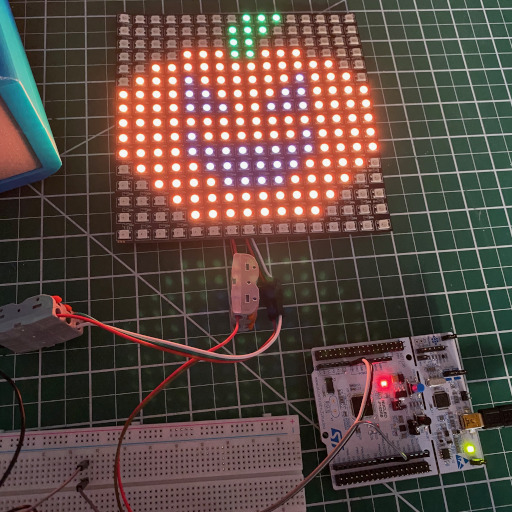

# Neopixel Art

I picked up some [16x16 neopixel panels from AliExpress](https://www.aliexpress.com/item/32789295872.html) and have wanted to play more with Rust and the STM32F103 development board I have.

## Preparing the image

The image is written into the binary using the `include_bytes!` macro. It expects an array of RGB values. I used ImageMagick to convert a 16x16 image.

```
convert my-image.png pixel-art.rgb
```

## Flashing the code

The STM32 dev board I have includes an STLink on board. Given how sensitive the neopixel driver is to timing, I have only been able to get release builds to display correctly.

```
cargo build --release
openocd -f openocd.cfg -c "program target/thumbv7m-none-eabi/release/neopixel-art; reset; exit"
```

## Result


